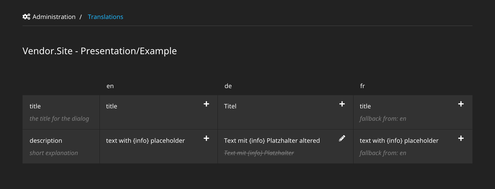

# Sitegeist.CsvPO

## Neos package for easy handling of translation labels in csv files, with a backend module for label overriding and cli support

This package allows to manage translations as csv-files directly in the 
fusion component folder with easy access in the style of css-modules.



The package comes with a backend module for overriding translations and 
cli commands to bake overrides back to the csv files for versioning.

Advantages:
- Translations are managed directly in a *translation.csv file in the fusion component folder
- Translations can be aded and used in a very simple way
- Translations can be edited in any spreadsheet app to spot missing translations directly
- Translations can be altered by customers and managers via backend module
- Altered translations can be stored back to the translation files via cli 
- The Neos locale fallback chain and the formatters are used as in the classic xliff translations   

Drawback:
- No pluralforms are supported (yet)
- This solution is probably not ideal for really large numbers of locales (>10) as the files will get out of hand
- Translations for NodeType inspector labels are not supported

## Authors & Sponsors

* Martin Ficzel - ficzel@sitegeist.de

*The development and the public-releases of this package is generously sponsored 
by our employer http://www.sitegeist.de.*

## Usage

The CsvPO helper provides the eel function `CsvPO.create` that takes 
the path to the translation csv file as argument. The returned object 
allows to access the translations in fusion and afx. 

Example.fusion
```neosfusion
prototype(Vendor.Site:Example) < prototype(Neos.Fusion:Component) {

    @private.i18n = ${CsvPO.create('resource://Vendor.Site/Private/Fusion/Presentation/Example.translation.csv')}

    renderer = afx`
        <div>
            {private.i18n.title} <br/>
            {private.i18n["subtitle"]} <br/>
            {private.i18n.text({info:'foo'})}<br/>
            {private.i18n.missing}s
        </div>
    `
}
```

## Chain translations and optional overrides 

When multiple csv files are given the labels from files at the end of the chain take precedence.

```neosfusion
prototype(Vendor.Site:Example) < prototype(Neos.Fusion:Component) {
    i18n = ${CsvPO.create('resource://Vendor.Site/Private/Fusion/TranslationChainExample/Generic.translation.csv', 'resource://Vendor.Site/Private/Fusion/TranslationChainExample/Override.translation.csv')}
}
```

Combined with the `@private` syntax from fusion in Neos 8.3 this allows to specify generic translations and allow to 
optionally pass translation-files that will take precedence.

```neosfusion
prototype(Vendor.Package:TranslationChainExample) < prototype(Neos.Fusion:Component) {

    # can be set from outside and is recommended to be null by default
    i18nOverride = 'resource://Vendor.Package/Private/Fusion/TranslationChainExample/Override.translation.csv'

    # combines a predefined translation with one that os passed as props.
    @private {
        i18n = ${CsvPO.create('resource://Vendor.Package/Private/Fusion/TranslationChainExample/Generic.translation.csv', props.i18nOverride)}
    }

    renderer = afx`
        <!-- access single translation -->
        <div>{private.i18n.example}</div>

        <!-- export all translations as json -->
        <div data-translations={Json.stringify(private.i18n.jsonSerialize())}></div>
    `
}
```
### Placeholders 

CSVPO supports the same syntax for placeholders as the classic xliff translations of Flow. 
See: https://flowframework.readthedocs.io/en/stable/TheDefinitiveGuide/PartIII/Internationalization.html?highlight=translations#placeholders 

```neosfusion
    # customize translation with params
    example1 = ${private.i18n.example('hello', 'world')}
    
    # placeholders can also be passed as array 
    example2 = ${private.i18n.example(['hello', 'world'])}
    
    # or as named data-structure
    example3 = ${private.i18n.example({title:"hello"})}
```

### Global translations

Global translations can be extracted into a prototype to be used across the whole project. It is recommended to 
use the `Neos.Fusion:Memo` as base prototype to only evaluate the prototype once.

```neosfusion
prototype(Vendor.Site:GlobalTranslations) < prototype(Neos.Fusion:Memo) {
    discriminator = 'Vendor.Site:GlobalTranslations'
    value = ${CsvPO.create('resource://Vendor.Site/Private/Fusion/Presentation/Globals.translation.csv')}
}

prototype(Vendor.Site:Example) < prototype(Neos.Fusion:Component) {

    @private.i18n = Vendor.Site:GlobalTranslations

    renderer = afx`
        <div>
            {private.i18n.title} <br/>
            {private.i18n.text({info:'foo'})}<br/>
        </div>
    `
}
```

In `Development` context missing translations are marked with `-- i18n-add --` 
if the identifier is unknown and `-- i18n-translate --` if the translation value
was empty. In `Production` context the identifier is returned when no translation 
could be determined.

## CSV files 

Each csv file manages a number of translations in all locales. The First line
of the csv is treated as header and identifies the meaning of the translation.

Example.translation.csv
```
id,description,en,de
title,the title for the dialog,title,Titel
description,short explanation,text with {info} placeholder,Text mit {info} Platzhalter
```

Rules:
- The column `id` represents the label identifier
- The column `description` represents the label description
- All other columns are treated as beeing a translation for the locale from the header line
- Arguments passed to the translations replace placeholders in curly braces. 
- Html markup in translation labels is supported  
- The csv files uses `,` as delimiter and `"` as text delimiters.    

CSV file are chosen because of the wide tooling support since literally 
every spreadsheet application can edit those files.

NOTE: Using xliff was evaluated and rejected because it requires multiple 
files, makes it exceptionally hard to spot missing translations and has 
very weak tooling support. The only xliff feature csv does not support is 
plural forms which is rarely used. 

## Backend Module & Policies

The Translations backend module allows to show all translations of the given source. 
Translation overrides can be defined and are visualized for the editors aswell 
as fallbacks.


The backend module is accessible to the roles `Administrator` and 
`TranslationEditor`. `Editors` must be given access to modify the 
translations explicitly.

## CLI

CvsPO comes with several cli commands

- `csvpo:list` Show a list of all translation sources
- `csvpo:show` Show the translations of the specified source
- `csvpo:showAll` Show the translations of the specified source
- `csvpo:bake` Bake the translations of the specified source back to the csv file
- `csvpo:bakeAll` Bake the overrides all source back to the csv files
- `csvpo:reset` Reset translation overrides of the specified source
- `csvpo:resetall` Reset translation overrides of all sources

## Configuration

The following configurations allow to control the behavior of the package 
and the provided management options.

```yaml
Sitegeist:
  CsvPO:

    # render visible hint for missing translations
    # is enabled by default for debug mode
    debugMode: false

    # Control which translation options are available in
    # the backend module and the cli
    management:
      # enable locallization overrides, disables in contexts
      # without database like visual regression testing
      enabled: true    

      # package keys to scan for translation files
      packageKeys: []

      # list of locales to manage in the backend module
      locales: ['en']

      # file extension to search for translations
      fileExtension: '.translation.csv'

      # folder inside the package resources to search for translations
      resourcePath: 'Private/Fusion'
```

## Caching

Translations are cached in the `Sitegeist_CsvPO_TranslationCache` Cache.
A file monitor will invalidate the caches whenever a .csv file is changed 
inside a Fusion Folder of any Flow-Package. 

If you are storing the translation csv files in another place make sure to
call `./flow cache:flushone Sitegeist_CsvPO_TranslationCache` after changing
a translation.csv.

### Installation 

Sitegeist.CsvPO is available via packagist. Just run `composer require sitegeist/csvpo`.
We use semantic-versioning so every breaking change will increase the major-version number.
